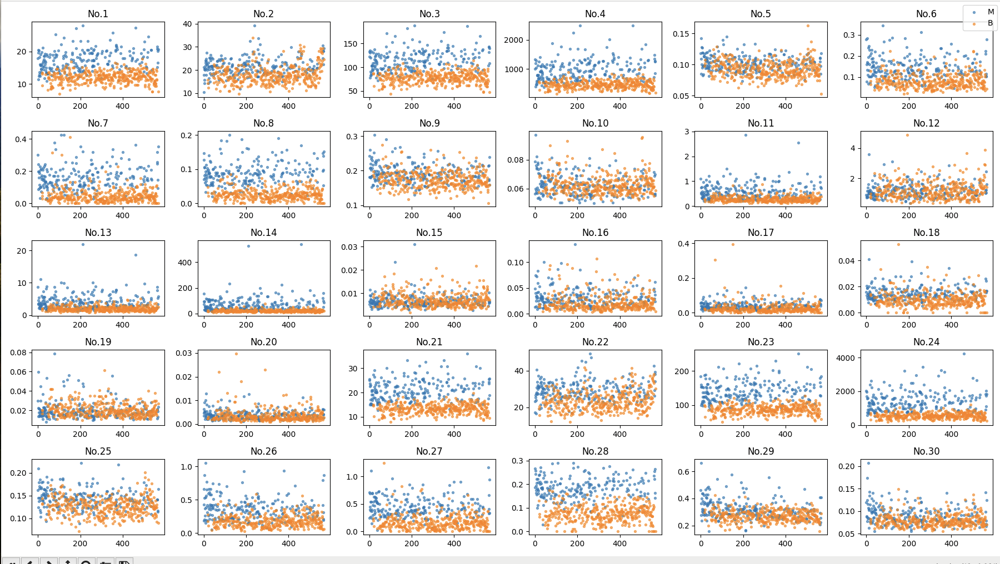

# 🧬 Breast Cancer Classification — MLP from Scratch
A fully vectorized Multi-Layer Perceptron (MLP) built from scratch using **NumPy only**, trained to classify breast cancer tumors as malignant (M) or benign (B). PyTorch and TensorFlow implementations are included as baselines for performance comparison. ⚖️
 
> **Peak accuracy: 98%** 🎯 — achieved with data scaling, feature selection, and hyperparameter tuning.
 

## 🧠 The Custom Engine (`nn.py`)
 
The heart of the project is a **scalar-free, fully vectorized autograd engine** — no loops over individual samples.⚡ The `Value` class wraps NumPy arrays and tracks computational graphs for automatic differentiation.
 
Supported operations with backward passes:
 
| Operation | Method |
|-----------|--------|
| Matrix multiply | `matmul` 🔢|
| Element-wise add/mul/sub | `+`, `*`, `-` ➕|
| Power | `**` 🔋|
| ReLU | `relu()` 📈|
| Log / Exp | `log()`, `exp()` 🪵|
| Absolute value | `abs()` 📏|
| Mean (scalar reduction) | `mean()` 📊|
The `MLP` class stacks `Layer` objects, each initialised with He initialisation (`√(2/n_in)`) and optional ReLU activation. The output layer is linear (logits), with the loss function handling the sigmoid internally for numerical stability. 🛡️
 

## 🏎️ Quickstart
 
### 1. Preprocess the data 🧹

 
 
```bash
# Optional: visualise feature distributions
python3 srcs/describe.py data.csv --visual
```
 
This will:
- Drop the patient ID column 🆔
- Encode labels (`M` → 1, `B` → 0) 🏷️
- Handle NaN values (mean imputation by default) 🩹
- Drop statistically noisy features via the **Mann-Whitney U test** 🔍
- Split data 70 / 15 / 15 into `data/train.csv`, `data/val.csv`, `data/test.csv` ✂️

### 2. Train the custom MLP 🔁

```bash
python3 srcs/train.py data/train.csv data/val.csv \
    --layers 64 64 32 1 \
    --lr 0.005 \
    --epochs 100 \
    --patience 10
```
 
The best model (lowest validation loss) is saved to `model/model.pkl`.💾 Loss and accuracy curves are plotted at the end of training.
 
### 3. Evaluate 🔎
 
```bash
python3 srcs/predict.py
```
### 4. (Optional) Train PyTorch or TensorFlow versions 🤖
 
```bash
python3 srcs/pytorchtrain.py
python3 srcs/pytorchpredict.py
 
python3 srcs/tensorflowtrain.py
python3 srcs/tensorflowpredict.py
```
 
## 🧪 Data Preprocessing (`describe.py`)
 
| Step | Detail |
|------|--------|
| NaN handling | Fill with column mean (or drop rows with `handle_nan='drop'`) |
| Feature filtering | Mann-Whitney U test, threshold `p < 1e-21` |
| Normalisation | Z-score standardisation (mean/std computed on train set only) |
| Split | 70% train / 15% val / 15% test, random permutation |
 
 ## 🏁 Model Comparison
 
| Implementation | Framework | Key features |
|---------------|-----------|-------------|
| `train.py` + `nn.py` | NumPy only 🛠️| Custom autograd, vectorized, no ML library, early stopping |
| `pytorchtrain.py` | PyTorch 🔥| BCEWithLogitsLoss, Adam, LR scheduler, early stopping |
| `tensorflowtrain.py` | TensorFlow/Keras ❄️| Sequential API, EarlyStopping, ReduceLROnPlateau, ModelCheckpoint |
 
All three implementations use the same network topology (configurable hidden layers), the same train/val/test split, and StandardScaler normalisation. ✅
 

## 🛠️ Requirements
All dependencies are listed in ``requirements.txt``. A script ``venv.sh`` is provided to simplify the installation and create a virtual environment for the program.
 
```bash
chmod 755 venv.sh
./venv.sh
```
 

## 🏆 Results
 
With the default configuration (`layers: [64, 64, 32, 1]`, `lr: 0.005`, feature selection enabled):
 
- **Custom NumPy MLP:** ~98+% test accuracy
- **PyTorch MLP:** ~98+% test accuracy  
- **TensorFlow MLP:** ~98+% test accuracy
 
